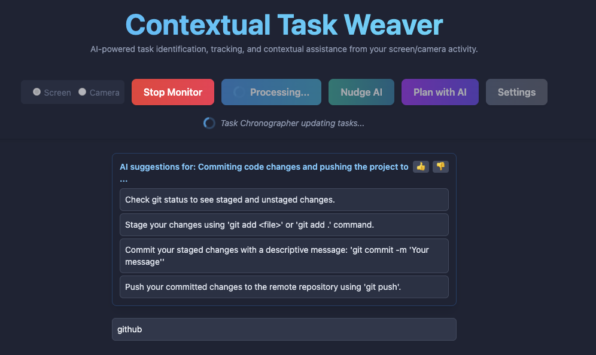

# Contextual Task Weaver (ETMS Core)



**Version:** 1.0.1 (Phase 2.5 Complete)

## Overview

Contextual Task Weaver is an AI-powered Emergent Task Management System (ETMS) designed to seamlessly integrate contextual understanding from your screen or camera activity into an evolving Kanban-style task board. The system aims to embody principles of emergent intelligence. This is envisioned to develop through continuous learning from user interactions and explicit feedback, guided by an Evolving Knowledge Store that enriches the LLM agent's contextual understanding. The system aims to transition from reactive task management to offering increasingly sophisticated proactive and automated assistance. It learns from your interactions, offers proactive assistance through contextual suggestions, helps you plan projects using external Large Language Models (LLMs), and allows for a user-defined 'Current Directive' to guide its focus. This application is built with React, TypeScript, Vite, and TailwindCSS, and leverages the Google Gemini API for its core AI capabilities.

## Core Features

*   **Contextual Capture (Screen & Camera):**
    *   Monitor your screen or use your camera as input.
    *   Selectable capture modes (Screen/Camera).
    *   Periodic, configurable capture intervals or manual capture on demand.
    *   Visual preview of the latest capture.

*   **AI-Powered Analysis & Task Evolution:**
    *   **Cognitive Parser (Gemini):** Analyzes captured images to infer current activity, active application, window titles, key texts, UI elements, and importantly, *active user text input*.
    *   **Task Chronographer (Gemini):** Updates a Kanban board (To-Do, Doing, Done) by:
        *   Identifying new tasks from the parsed context.
        *   Updating existing tasks based on ongoing activity.
        *   Marking tasks as complete.
        *   Considers a derived *meta-intent* from sequential contexts and the *current directive* to guide task updates.
    *   **Contextual Suggestions (Gemini):** Provides actionable suggestions based on your inferred activity, goals, and the *current directive* (e.g., next steps, related searches).
    *   **Dynamic Context Management & Meta-Intent Stitching:**
        *   Maintains a weighted memory of contextual keywords and themes.
        *   Analyzes sequences of contexts to infer a higher-level *meta-intent*, which informs task generation and suggestion relevance.
    *   **Promptable Current Directive:**
        *   Users can set a specific textual directive (e.g., "Focus on debugging Python code," "Research market trends for X") that guides the AI's interpretation of context, task generation, and suggestions.
    *   **Enhanced LLM Orchestration (Future Vision):** Architectural planning for potentially leveraging diverse, specialized LLMs for various internal cognitive tasks as the system's complexity and capabilities expand, allowing for more nuanced analysis and decision-making.

*   **Kanban Task Management:**
    *   Tasks are organized into "To-Do," "Doing," and "Done" columns.
    *   Task cards display descriptions, status, timestamps, confidence scores, and activity history.
    *   Expandable task cards show detailed context information from when the task was first seen and last updated.

*   **Project Planning with External LLMs:**
    *   Describe a project goal.
    *   Select a configured external LLM (e.g., OpenAI, other Gemini instances, custom endpoints).
    *   The system sends your goal and a prompt instruction to the LLM to generate a list of tasks, which are then added to your "To-Do" column.

*   **Settings and Configuration:**
    *   **App Settings:** Adjust capture interval and maximum task list size.
    *   **External LLM Connectors:** Add, edit, or delete configurations for external LLMs, including API endpoint, API key, and a custom prompt instruction for task generation.

*   **Local Storage Persistence:**
    *   Tasks, detailed context history (`allContexts`), application settings, LLM configurations, dynamic context memory, and potential main tasks are saved in your browser's local storage, so your data persists across sessions.

## Tech Stack

*   **Frontend:** React 18+
*   **Build Tool:** Vite
*   **Language:** TypeScript
*   **Styling:** TailwindCSS
*   **AI:** Google Gemini API (`@google/genai`)
*   **Backend (Native Hook):** Python 3.9+ (specifically for macOS)
    *   `pyobjc-framework-Cocoa` for macOS native interactions.
    *   `websockets` for communication with the frontend.
    *   `watchdog` for potential future file system monitoring.
*   **State Management:** React Hooks (`useState`, `useEffect`, `useCallback`, `useRef`)
*   **Dependencies:** Managed via `package.json` (e.g., `uuid` for generating unique IDs).

## Setup and Running

This application consists of a React frontend and a Python-based native hook for macOS interactions. Both need to be set up and running.

**1. Frontend (React Application):**

*   **API Key:**
    *   This application requires a Google Gemini API key.
    *   Create a `.env` file in the project root.
    *   Add your API key to the `.env` file like this:
        ```
        VITE_API_KEY=your_actual_gemini_api_key_here
        ```
    *   The application accesses this key via `import.meta.env.VITE_API_KEY`.

*   **Dependencies:**
    *   Install dependencies using npm (or your preferred package manager) from the project root:
        ```bash
        npm install
        ```

*   **Running the Frontend:**
    *   Start the Vite development server from the project root:
        ```bash
        npm run dev
        ```
    *   Open the provided local URL (usually `http://localhost:5173/`) in a modern web browser that supports screen capture and camera access.

**2. Backend (Python Native Hook - macOS only):**

The native hook enables deeper interaction with the macOS operating system, such as simulating mouse clicks or typing.

*   **Python Version:**
    *   It's recommended to use Python 3.9 or newer. Python 3.11.9 is known to work well.
    *   If you encounter issues with Python versions, using a version manager like `pyenv` is highly recommended. For example:
        ```bash
        # Install a specific Python version (if not already installed)
        pyenv install 3.11.9
        # Set it as the local version for the hook's directory
        cd native_hook
        pyenv local 3.11.9
        cd ..
        ```

*   **Dependencies:**
    *   Navigate to the `native_hook` directory:
        ```bash
        cd native_hook
        ```
    *   Install Python dependencies using pip (preferably within a virtual environment):
        ```bash
        pip install -r requirements.txt
        ```
    *   If you used `pyenv local` in the previous step, ensure pip corresponds to that Python version.

*   **Running the Native Hook:**
    *   From within the `native_hook` directory, run:
        ```bash
        python3 main_hook.py
        ```
        (Or `python main_hook.py` if `python` points to your desired Python 3.9+ version).
    *   This server will run in the foreground by default. You might want to run it in the background for convenience during development (e.g., `python3 main_hook.py &`). It typically listens on `ws://localhost:8765`.

**Both the frontend Vite server and the Python `main_hook.py` server must be running concurrently for the application to be fully functional.**

## Key Files and Folder Structure

*   `index.html`: Main entry point, loads TailwindCSS, and mounts the React app.
*   `index.tsx`: Initializes and renders the main `App` component.
*   `App.tsx`: The core application component, managing state, logic, and orchestrating UI components.
*   `types.ts`: Defines all TypeScript types and interfaces used throughout the application (located at the project root).
*   `roadmap.md`: Outlines the future development path and vision for the project.
*   `components.md`: Documents the UI components.
*   `data_structures_and_context_management.md`: Documents data structures and context management strategies.
*   `package.json`: Lists project dependencies and scripts.
*   `vite.config.ts`: Configuration for the Vite build tool.
*   `.env`: Stores environment variables like the API key (should be in `.gitignore`).
*   `tsconfig.json`: TypeScript compiler configuration.
*   `styles.css`: Global styles, TailwindCSS imports, and custom scrollbar styles.
*   `metadata.json`: Contains application metadata, including permissions for camera and display capture.
*   **`components/`**: Contains all React UI components:
    *   `MonitoringControls.tsx`: Buttons and controls for starting/stopping monitoring, manual capture, settings, capture mode selection, and setting the Current Directive.
    *   `TaskColumn.tsx`: Represents a column (To-Do, Doing, Done) in the Kanban board.
    *   `TaskCard.tsx`: Displays individual task details.
    *   `SettingsModal.tsx`: Modal for configuring app settings and external LLM connectors.
    *   `PlanProjectModal.tsx`: Modal for generating tasks from a goal using an external LLM.
    *   `ContextualSuggestionsDisplay.tsx`: Shows AI-generated suggestions.
    *   `ScreenPreview.tsx`: Displays the latest captured screen/camera image.
    *   `LoadingSpinner.tsx`, `ErrorMessage.tsx`: Utility UI components.
*   **`services/`**:
    *   `geminiService.ts`: Handles all interactions with the Google Gemini API (Cognitive Parser, Task Chronographer, Contextual Suggestions), now incorporating the Current Directive and Meta-Intent.
    *   `dynamicContextManager.ts`: Manages the dynamic context memory, potential main tasks, and meta-intent analysis.
    *   `logger.ts`: Basic structured logging utility.
    *   `documentFetcher.ts`: Utility for fetching external documents like Harmonia Digitalis.
*   **`native_hook/`**: Contains the Python-based backend for macOS native interactions.
    *   `main_hook.py`: The WebSocket server that listens for commands from the frontend and interacts with the OS.
    *   `requirements.txt`: Python dependencies for the native hook.
    *   `os_computer_use/`: Modules for specific OS interactions (e.g., mouse, keyboard).
*   **`types/` is now `types.ts` at the root.** (Correction: this line is redundant as types.ts is already listed above)

## Troubleshooting

*   **Gemini API Error: "Unknown name 'config'..." (or similar 400 Bad Request errors from `generativelanguage.googleapis.com`)**:
    *   This often indicates that the frontend is serving an outdated version of `services/geminiService.ts` where the API call structure was incorrect.
    *   **Solution:** Stop your Vite development server (`npm run dev`) and restart it. This usually clears any caching issues.

*   **Python Hook: `FileNotFoundError: [Errno 2] No such file or directory: ... main_hook.py`**:
    *   This means you are trying to run `python3 main_hook.py` (or similar) from a directory other than `native_hook/`.
    *   **Solution:** Ensure you `cd native_hook` before running the script.

*   **Python Hook: Dependency or Version Issues (e.g., `ImportError`, `No matching distribution found`)**:
    *   These often relate to the Python version or missing/incorrectly installed dependencies for `pyobjc` or other packages in `native_hook/requirements.txt`.
    *   **Solution:**
        1.  Ensure you are using Python 3.9+ (3.11.9 recommended). Use `pyenv` to manage Python versions if needed.
        2.  From the `native_hook` directory, ensure you have installed dependencies with `pip install -r requirements.txt` using the pip associated with your target Python version.
        3.  If you recently changed Python versions (e.g., with `pyenv local`), you might need to re-create your virtual environment (if using one) and/or re-install dependencies.

*   **Frontend and Backend Not Communicating**:
    *   Ensure both the Vite development server (`npm run dev` in the project root) AND the Python hook server (`python3 main_hook.py` in `native_hook/`) are running without errors.
    *   Check browser console logs and the terminal output of `main_hook.py` for any specific error messages.

## Important Considerations

*   **API Quotas & Billing:** Frequent use, especially with short capture intervals, can lead to hitting Gemini API rate limits or incurring costs. Monitor your usage and ensure your billing is set up correctly with Google Cloud. The application handles `429 RESOURCE_EXHAUSTED` errors by displaying a message.
*   **Privacy:** Be mindful of the information visible on your screen or captured by your camera when monitoring is active. The application processes this data to provide its features. API keys for external LLMs are stored in local storage for development convenience; for production, consider a backend proxy.
*   **Browser Permissions:** You will need to grant permissions for screen capture and/or camera access when prompted by your browser.

## Future Development

The long-term vision for Contextual Task Weaver extends significantly beyond current capabilities, aiming for a highly intelligent and autonomous task management partner. Future development, as detailed in the `roadmap.md`, will focus on:

*   **Advanced Autonomous Task Capabilities:** Progressing towards enabling the system to autonomously execute certain delegated tasks based on learned patterns and contextual triggers from its Evolving Knowledge Store.
*   **Sophisticated Proactive Assistance:** Moving beyond simple suggestions to offer deeply contextualized, predictive support and information based on a rich understanding of user workflows and goals.
*   **Complex System Integrations & Agent Interaction (Research & Development):** Exploring controlled and secure interactions with external tools, APIs, and specialized AI agents (e.g., coding assistants, research tools). This R&D area will prioritize robust safety protocols, user permissions, and auditable interactions.
*   **Deep Knowledge Store Evolution:** Transitioning towards a more powerful backend Knowledge Store (e.g., graph database) to support advanced reasoning, longitudinal learning, and complex pattern analysis necessary for true emergent intelligence.
*   **Principled AI Operation:** Ensuring all AI operations are guided by foundational ethical and operational principles, such as those outlined in the "Harmonia Digitalis Document," which will be integrated into the core reasoning processes of its LLM agents.

Refer to the `roadmap.md` file for a more granular, phased outline of planned features, including the upcoming "Co-Captain" (v2.8) enhancements for deeper macOS integration and control.
